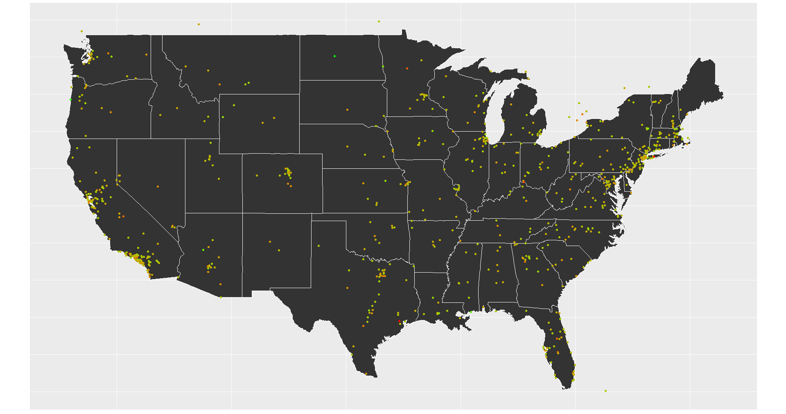
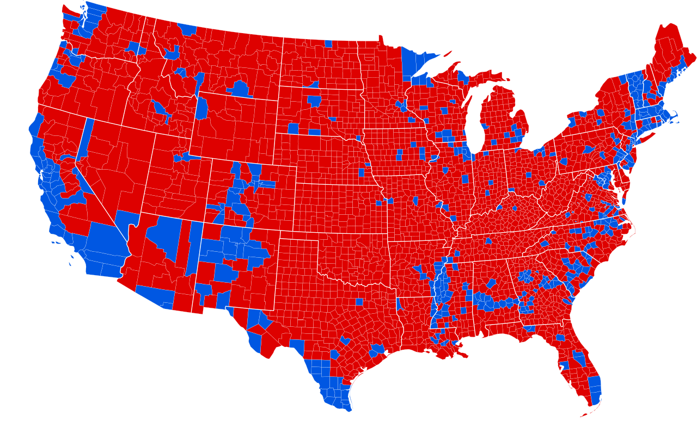

## NLP study for financial analyst reports - Internal Research Project at SEB   

Note: Project still in the initial phase of development, will be updated with more information as the project progresses.  
Implementing machine learning and state-of-the-art NLP-frameworks on real data in cooperation with data scientists and analysts at SEB. **Tools:** Python, Tensorflow, Google Cloud Platform (BigQuery) etc.  
By combining neural-network language processing and generative statistical modeling the goal is to analyze financial reports and extract information from the unstructured textual data such as sentiments, market indicators, company descriptions etc.

Project plan:  
- Phase one - **Topic modelling** following paper by [**Chang et. al.**](https://papers.ssrn.com/sol3/papers.cfm?abstract_id=3307057)  
  Word embedding using Word2Vec, Skipgram, Continuous Bag of Words (CBOW)  
  Clustering using Locality Sensitive Hashing (LSH)  
  Topic modelling using textual factors  

- Phase two - **Sentiment analysis**  
  Perform sentiment analysis  
  Potentially compare other approaches for benchmarking   
  Visualise data clusters and validate results  

## Pneumonia X-Ray Image Classification

- [**Github Code**](https://github.com/diarsabri/Pneumonia-X-Ray-Image-Classification)  
Explores diagnosing pneumonia through chest x-ray images with the help of deep learning (TensorFlow & Keras) and various data augmentation methods. Mostly related to evaluating different state-of-the-art data augmentation methods and researching these on a medical dataset which fills a research gap. The project was initiated due to the current global pandemic with the hope that some valuable research on this specific segment was conducted.

## Bachelor of Science thesis

- [**Sentiment and growth of different news categories on Twitter: A study in Natural Language Processing**](http://urn.kb.se/resolve?urn=urn:nbn:se:kth:diva-259986)  
Quantitative NLP-study of the geographical spread and growth of tweets regarding different news categories. Confined to tweets in the U.S on five self-established categories. Coding mostly in R & some Python, using the Twitter API as a data source.
- [Code](https://github.com/diarsabri/BSC-KTH-2019)

Sentiment of Political Tweets  

U.S 2016 election results  

## Stockholm City Museum / Nordic Museum Audioguide

- [**Audioguide (iOS)**](https://apps.apple.com/se/app/nordiska-museets-audioguide/id1205181365)
Built the foundation from scratch together with a project group. Coding in JavaScript & React-Native. Built with the intention that other museums take part of the application and integrate it in their own systems. Currently in use by the Nordic Museum, and soon Jamtli museum.
- [Our code](https://github.com/Carlhultberg/MVK-2018-Pub)
